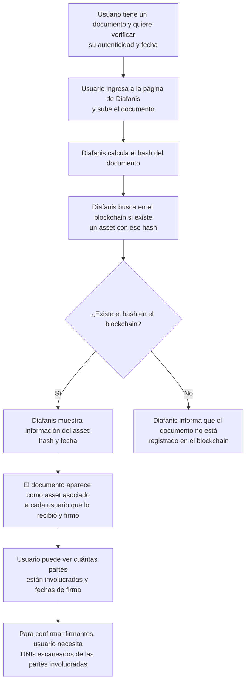

# Diafanis y Fundación

* Usuarios navegan una pagina para descubrir proyectos que buscan donaciones
* Seleccionan uno, y antes de donar, deben ingresar o registrarse
* Esto se hace usando login social (Google, Microsoft, Apple?) y el siguiente proceso tiene 
  lugar:
    1. Si se esta registrando por primera vez:
       - Se genera un GUID/ULID aleatorio para el usuario como claim/atributo estable
       - El usuario también debe proveer un escaneo del código de barras en su DNI
       - Debe elegir un PIN de 6 dígitos que solo el sabra y no tiene recuperación (no se guarda en el sitio 
         web por seguridad)
       - Este conjunto de datos se utiliza para crear un usuario en el blockchain
    2. Si ya esta registrado:
        - Ingresa con su cuenta de Google/Microsoft/Apple directamente
* El PIN solo se utiliza para confirmar la identidad del usuario al "firmar" documentos, 
  como el recibo de una donación a un proyecto especifico.
* El usuario puede ver su historial de donaciones y el estado de las mismas sin necesidad de 
  ingresar el PIN. Esta información esta almacenada en el blockchain y el sitio web indexa 
  adicionalmente para mejorar la velocidad de acceso.

* Cuando el usuario elige un proyecto para donar, se le muestra un resumen del proyecto y 
  el monto que desea donar. Efectúa el pago por transferencia directa al CBU/CVU del proyecto
* Cuando el monto impacta en la cuenta del proyecto, se dispara un proceso que emite un recibo 
  digital que el usuario debe firmar con su PIN (se envía una notificación por mail, y opcionalmente 
  por WhatsApp si registro su numero). La firma electronica (hash) de este recibo se almacena en 
  el blockchain como un asset (similar a un NFT) conteniendo la identidad de la organización que 
  lo emite (via su firma privada). 
* El usuario que recibe el recibo, solo puede accederlo/descargarlo después de ingresar su PIN 
  para confirmar su identidad. En este paso, se crea a su vez un asset en el blockchain con el 
  mismo hash del recibo, pero firmado por el usuario (con su clave privada). Esto vincula a 
  ambos participantes en la transacción y permite la trazabilidad de la misma.
* El contenido del documento NO es guardado públicamente en el sitio ni en el blockchain por 
  cuestiones de privacidad, pero se puede verificar su autenticidad con la firma electronica 
  almacenada en el blockchain. Por ejemplo, el contador, un abogado o un juez, puede tomar 
  el documento provisto como comprobante y verificar su autenticidad asi como la fecha y las 
  partes involucradas en el mismo. La información de las partes involucradas también se almacena 
  solamente como un hash en el blockchain, para proteger la privacidad de los usuarios también.
  (pero teniendo el DNI escaneado, se puede verificar la identidad de las partes si es necesario)
* Para facilidad de los usuarios, la pagina/app puede ofrecer un servicio de almacenamiento 
  de los recibos firmados, encriptados con su clave privada, en la nube (Google Drive, OneDrive, 
  iCloud) para que puedan acceder a ellos fácilmente en el futuro. Adicionalmente, si existe 
  una app móvil, se puede almacenar en el dispositivo o en servicios en la nube que el usuario 
  tenga configurados en el mismo.
* Cuando el receptor de la donación efectúa un gasto contra la cuenta del proyecto, se le 
  requiere una rendición del gasto correspondiente. Puede tratarse de una foto de un ticket, 
  una factura, etc. El receptor, al igual que el usuario que dono, debe firmar el documento 
  con su PIN para confirmar su identidad. Este proceso es similar al de la aceptación del 
  recibo de una donación (hash en asset en el blockchain a su nombre).

El servicio de interacción con el blockchain (Diafanis de ahora en mas) es un servicio utilizado 
exclusivamente por el sitio web para crear cuentas, registrar y firmar documentos, y verificar 
la autenticidad de los mismos. El sitio web de la fundación se encarga de la interface
para alta/baja de proyectos, donaciones, etc. y de la interacción con los usuarios. Diafanis 
provee una API REST para que el sitio web pueda interactuar con el blockchain de forma segura.

## Diagrama Interacción

## Verificación de Recibos

1. Un usuario tiene un documento y quiere verificar su autenticidad asi 
   como la fecha 
1. Ingresa a la pagina de Diafanis y sube el documento
2. Diafanis calcula el hash del documento y busca en el blockchain si existe 
   un asset con ese hash
3. Si existe, Diafanis devuelve la información del/los asset (hash y fecha), 
   dado que el mismo documente aparecerá como asset asociado a cada usuario 
   que lo recibió y firmo. 
4. Dado que la información personal de los individuos no existe en el blockchain, 
   el usuario debe tener acceso al DNI escaneado de las partes involucradas 
   para poder confirmar que sean los firmantes. Pero si puede determinarse 
   cuantas partes están involucradas en el documento y la fecha en que fue firmado 
   por cada una de ellas.

### Diagrama Verification

